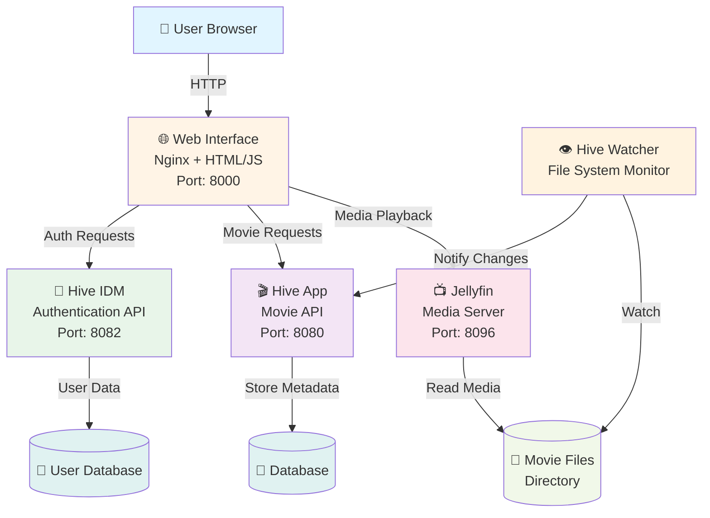
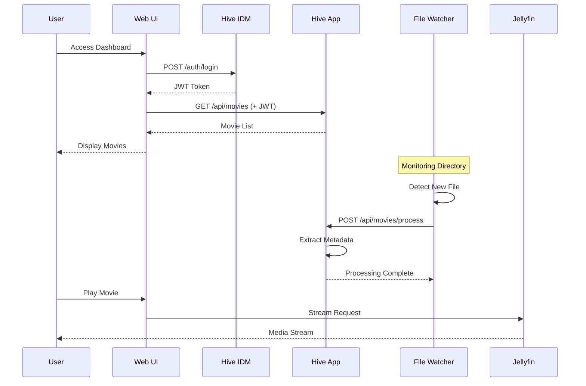

# 🎬 Hive - Self-Hosted Movie Management Platform

> A modern, microservices-based movie platform with automated media monitoring, user authentication, and a responsive web interface.

[](https://dotnet.microsoft.com/)
[](https://www.docker.com/)
[](LICENSE)

## 📖 Overview

**Hive** is an open-source, self-hosted movie management platform designed for media enthusiasts. It automatically monitors your movie directories, extracts metadata, and provides a beautiful web interface to browse and manage your collection. Built with modern .NET microservices architecture, it's fast, scalable, and easy to deploy.

### ✨ Key Features

- 🎥 **Automated Media Monitoring** - Watches your movie directories and automatically processes new files
- 🔐 **Secure Authentication** - JWT-based user authentication and authorization
- 🌐 **Modern Web UI** - Responsive interface for browsing and managing your collection
- 🎬 **Jellyfin Integration** - Seamlessly integrates with Jellyfin media server
- 🐳 **Docker Ready** - Easy deployment with Docker Compose
- 🏗️ **Clean Architecture** - Maintainable, testable, and scalable codebase

---

## 🏛️ System Architecture

Hive follows a **microservices architecture** with clean separation of concerns:



### 🔄 Data Flow

1. **User** accesses the web interface
2. **Web UI** authenticates via **Hive IDM** (gets JWT token)
3. **Web UI** fetches movie data from **Hive App**
4. **Watcher Service** monitors movie directory for changes
5. **Watcher Service** notifies **Hive App** of new/changed files
6. **Hive App** processes metadata and updates the collection
7. **Jellyfin** integration provides rich media playback

### 📊 Component Interaction



---

## 🏗️ Project Structure

```
project-hive/
├── src/
│   ├── app/
│   │   ├── Hive.App/                 # Movie API (REST endpoints)
│   │   └── Watcher.Console.App/      # File system watcher service
│   │
│   ├── idm/
│   │   ├── Hive.Idm.Api/             # Authentication API
│   │   └── Hive.Idm.Infrastructure/  # User database & repositories
│   │
│   ├── web/                          # Frontend (HTML/CSS/JS)
│   │   ├── pages/                    # Web pages
│   │   └── assets/                   # Static resources
│   │
│   ├── domain/Domain/                # Business entities & logic
│   ├── features/Features/            # Use cases (CQRS handlers)
│   ├── Infrastructure/               # Data access & integrations
│   └── common/Common/                # Shared utilities
│
├── tests/                            # Unit & integration tests
├── docker-compose.yaml               # Multi-service orchestration
└── Makefile                          # Development commands
```

### 📦 Architecture Layers

| Layer | Responsibility | Examples |
|-------|---------------|----------|
| **Presentation** | User interfaces & APIs | Web UI, REST endpoints |
| **Application** | Use cases & orchestration | CQRS handlers, commands/queries |
| **Domain** | Business logic & rules | Movie entities, validation |
| **Infrastructure** | External concerns | Database, file I/O, APIs |

---

## 🚀 Quick Start

### Prerequisites

- **Docker** or **Podman** (recommended)
- **Docker Compose** or **Podman Compose**
- **.NET 9.0 SDK** (only for local development)

### Option 1: Docker Compose (Recommended)

```bash
# 1. Clone the repository
git clone https://github.com/yourusername/project-hive.git
cd project-hive

# 2. Set environment variables
export UID=$(id -u)
export GID=$(id -g)

# 3. Start all services
make up
# or: docker-compose up -d

# 4. Access the application
# Web UI:       http://localhost:8000
# Movie API:    http://localhost:8080
# Auth API:     http://localhost:8082
# Jellyfin:     http://localhost:8096
```

### Option 2: Local Development

```bash
# 1. Restore dependencies
dotnet restore

# 2. Build the solution
dotnet build

# 3. Run tests
dotnet test

# 4. Start services individually
# Terminal 1 - Movie API
cd src/app/Hive.App
dotnet run

# Terminal 2 - Auth API
cd src/idm/Hive.Idm.Api
dotnet run

# Terminal 3 - File Watcher
cd src/app/Watcher.Console.App
dotnet run -- --watch /path/to/movies
```

---

## ⚙️ Configuration

### Environment Variables

Create a `.env` file in the project root:

```bash
# User permissions (for Docker volumes)
UID=1000
GID=1000

# Movie directory (adjust to your path)
MOVIES_DIR=/home/user/Movies

# Jellyfin (optional)
JELLYFIN_BASE_URL=http://localhost:8096
JELLYFIN_ACCESS_TOKEN=your-api-key-here
```

### Docker Compose Services

| Service | Port | Description |
|---------|------|-------------|
| `hive-app` | 8080 | Movie API |
| `hive-idm` | 8082 | Authentication API |
| `hive-watcher` | - | File monitor (background) |
| `project-hive-web` | 8000 | Web interface |
| `jellyfin` | 8096 | Media server (optional) |

### Volume Mappings

```yaml
volumes:
  # Configuration & cache
  - jellyfin-config:/config
  - jellyfin-cache:/cache
  
  # Movie directory (read-only)
  - "/path/to/your/movies:/app/shared:ro"
  - "/path/to/your/movies:/media:ro"  # Jellyfin mount
```

---

## 🛠️ Development

### Make Commands

```bash
make help          # Show all available commands
make up            # Start all services
make down          # Stop all services
make restart       # Restart services
make logs          # View logs (all services)
make logs-app      # View Movie API logs
make logs-idm      # View Auth API logs
make build         # Rebuild containers
make clean         # Remove containers
make status        # Show service status
```

### Running Tests

```bash
# Run all tests
dotnet test

# Run specific test project
dotnet test tests/Common.Tests/

# Run with coverage
dotnet test --collect:"XPlat Code Coverage"

# Watch mode (TDD)
dotnet watch test --project tests/Common.Tests/
```

### Adding New Features

1. **Domain Layer** - Add entities in `src/domain/Domain/Entities/`
2. **Features Layer** - Create handlers in `src/features/Features/`
3. **API Layer** - Add endpoints in `src/app/Hive.App/`
4. **Tests** - Write tests in corresponding `tests/` directory

---

## 🧪 Testing

The project includes comprehensive test coverage:

| Test Project | Coverage |
|--------------|----------|
| **Common.Tests** | Utilities, parsing, crypto |
| **Console.App.Tests** | File watcher logic |
| **Infrastructure.Tests** | Database, repositories |

**Testing Stack:**
- **xUnit** - Test framework
- **Moq** - Mocking
- **FluentAssertions** - Readable assertions

---

## 🐳 Docker Deployment

### Building Images

```bash
# Build all images
docker-compose build

# Build specific service
docker-compose build hive-app
```

### Production Deployment

```bash
# Start in production mode
ASPNETCORE_ENVIRONMENT=Production docker-compose up -d

# View logs
docker-compose logs -f

# Scale services (if needed)
docker-compose up -d --scale hive-app=3
```

### Health Checks

All services include health checks:

```bash
# Check service health
docker-compose ps

# Manual health check
curl http://localhost:8080/health
curl http://localhost:8082/health
```

---

## 🤝 Contributing

We welcome contributions! Here's how to get started:

1. **Fork** the repository
2. **Create** a feature branch (`git checkout -b feature/amazing-feature`)
3. **Commit** your changes (`git commit -m 'Add amazing feature'`)
4. **Push** to the branch (`git push origin feature/amazing-feature`)
5. **Open** a Pull Request

### Development Guidelines

- Follow Clean Architecture principles
- Write tests for new features
- Update documentation
- Follow C# coding conventions
- Ensure Docker builds succeed

---

## 📝 License

This project is licensed under the **MIT License** - see the [LICENSE](LICENSE) file for details.

---

## 🙏 Acknowledgments

- Built with [.NET 9.0](https://dotnet.microsoft.com/)
- [Jellyfin](https://jellyfin.org/) for media server integration
- [FastEndpoints](https://fast-endpoints.com/) for high-performance APIs
- [MediatR](https://github.com/jbogard/MediatR) for CQRS pattern

---

## 📞 Support

- 🐛 **Issues**: [GitHub Issues](https://github.com/yourusername/project-hive/issues)
- 💬 **Discussions**: [GitHub Discussions](https://github.com/yourusername/project-hive/discussions)
- 📖 **Documentation**: Check individual project README files

---

**Built with ❤️ by the open-source community**
